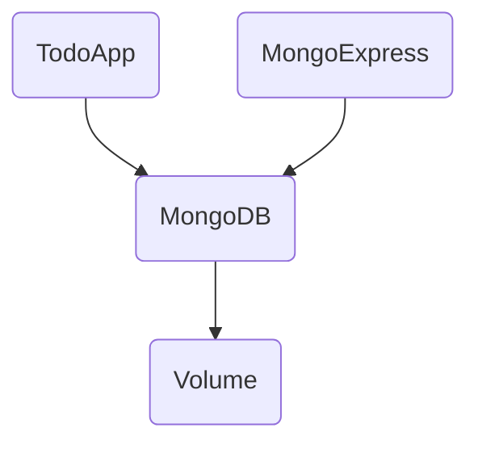

+++
title = "Build multi-container environment with Docker Compose"
weight = 10
date = 2024-03-25
draft = false
+++

## Introduction

The aim of this learning module is to create a multi-container environment with Docker Compose for an ASP.NET webapp that uses a MongoDB. By the end of this guide, you'll have a fully functional ASP.NET web app, connected to MongoDB, all running in Docker containers.

## Prerequisites

In order to follow along, ensure you have the following tools installed on your machine:

- Docker (Docker Desktop) installed on your local machine. [Download Docker](https://www.docker.com/products/docker-desktop).
- Visual Studio Code (VSCode) as your IDE. [Download VSCode](https://code.visualstudio.com/Download).
docs.microsoft.com/en-us/dotnet/core/tools/).
- .NET SDK 8.0 installed to build .NET applications. [Install .NET](https://dotnet.microsoft.com/download).

## Method

We'll take a step-by-step approach to containerize your environment:

1. **Individual Containers:** We'll begin by setting up individual containers for the ASP.NET app and MongoDB using Docker.
2. **Docker Compose:** Transition from manual container management to using Docker Compose for orchestrating our containers in a more manageable, declarative manner (IaC).

Overview of the environment



## Before we begin

Clone the example app from here:

```bash
git clone https://github.com/Campus-Molndal/ToDoApp.git
cd ToDoApp
```

Run the application and verify that it works.

```bash
dotnet run
```

## Step 1: Setup a MongoDB as a Docker container

MongoDB has its own official Docker image at Docker Hub called `mongo`. This container will act as the database for our ASP.NET application. In order to make it available locally for the application we run it like this:

1. Start MongoDB with Docker:

    ```bash
    docker run -d -p 27017:27017 --name db mongo
    docker ps
    ```

2. Switch the ASP.NET app to use MongoDB by setting an environment variable:

    ```bash
    export TODO_SERVICE_IMPLEMENTATION=MongoDb
    dotnet run
    ```

	You should now be able to interact with the app and see that it uses MongoDB for data storage.

3. **Bonus**: Use Mongo Express for database inspection. It's a web-based MongoDB admin interface. Start it in Docker and connect it to your MongoDB container.
	
	The docker conainers are launched in a separate docker network with its own IP range. Let's find out the IP address of the MongoDB container in the default network.
	
	```bash
	docker inspect db | grep IPAddress
	```
	
	You should get an output like this. The IP address might not be the same.
	> Output
	
	```
	"SecondaryIPAddresses": null,
	"IPAddress": "172.17.0.2",
	   "IPAddress": "172.17.0.2",
	```
	
	Use the IP adress you have in your environment and run the Mongo Express container
	
	```bash
	docker run -d -p 8081:8081 --name mongo-express2 -e ME_CONFIG_MONGODB_SERVER=172.17.0.2 mongo-express
	```
	
	Browse to Mongo Express on `localhost:8081` and find the database and the collection. Verify that it works.

### Persist the database

Currently the data persistence of the MongoDB is inside the container. This means that if we remove the container and spin up a new one all data is lost. Let's create a named volume and attach it to the mongodb container.

```bash
docker rm -f db
docker volume create mongodb-data
docker run -d -p 27017:27017 -v mongodb-data:/data/db --name db mongo
```

## Step 2: Containerize the ASP.NET Application

Here we'll encapsulate our ASP.NET app in a Docker container, following best practices. Microsoft advocates a two-stage approach when containerizing an ASP.NET web application. In the first stage we build and publish the app and in the second stage we build the runtime image based on the artifacts from stage one.

1. **Dockerize the Application**: Utilize a multi-stage Dockerfile to build and run your ASP.NET application. This method ensures your Docker image is as lean as possible.

	An easy way to create a Dockerfile for the application is to use a Docker wizard:
	
	```bash
	docker init
	```
	
	Follow the instructions in the wizard. Normally it auto detects the project and you only have to confirm its suggestions by pressing `<Enter>`
	
	Now, build the docker image
	
	```bash
	docker build -t todoapp .
	```

2. **Run Your Containerized App**: With your Docker image built, start your application as a Docker container, exposing it on a specific port to access it via a web browser.


	Start the todoapp container:
	
	```bash
	docker run -p 8080:8080 todoapp
	```
	
	Verify it works by browsing to `localhost:8080`. You should see that the app uses the JSON database.

### Connect the todoapp to the mongodb container

It's time to connect the two containers in a similar fashion as with the Mongo Express container.

```bash
docker run -p 8080:8080 -e MongoDbSettings__ConnectionString="mongodb://172.17.0.2:27017" -e TODO_SERVICE_IMPLEMENTATION=MongoDb -e ASPNETCORE_ENVIRONMENT=Development todoapp
```

There are three environment variable that we need to add:

- The MongoDB connection string (in the docker network)
- The Service implementation (MongoDb)
- Run in development mode (since the settings are in `appsettings.Development.json`)


Verify that it works.

## Step 3: Use a Docker Network

This step involves configuring our containers to communicate over a private, Docker-managed network.

One of the benefits of using docker is that you don't have to expose all services to the outer world. In this case we never interacts directly with the MongoDB. Either we do it through the todo app or through Mongo Express.

We can use the Docker Network to keep the database unexposed. Docker also has a local DNS and service discovery function built-in. This means that we can use the docker name to reference it within the Docker Network (however, not in the default network).

First let's remove all containers. We can do that by levereging _command expansion_. 
> Warning: Only do this if you have nothing important running. All containers are removed.

```bash
docker rm -f $(docker ps -aq)
```

First we need to create a Docker Network

```bash
docker network create todonet
```

Next we need to start all the other containers and attach them to the network. In order to use _service discovery_ the containers need to be attached to the same network.

```bash
docker run -d --name db --network todonet -v mongodb-data:/data/db mongo
docker run -d -p 8081:8081 --name mongo-express --network todonet -e ME_CONFIG_MONGODB_SERVER=db mongo-express
docker run -d -p 8080:8080 --name todoapp --network todonet -e MongoDbSettings__ConnectionString="mongodb://db:27017" -e TODO_SERVICE_IMPLEMENTATION=MongoDb -e ASPNETCORE_ENVIRONMENT=Development todoapp
```

> Examine the commands thoroughly. Note how the network, names and environment variables are linked together.

Verify that it works.

## Step 4: Use Docker Compose

In order to facilitate the orchestration of multiple docker containers we can use Docker Compose. It's an IaC tool where we can describe an entire docker environment using YAML.

You'll define a `compose.yaml` file, describing your application's structure, including the ASP.NET app, MongoDB, and any additional services like Mongo Express. This approach enables you to start, stop, and manage your entire environment with simple Docker Compose commands.

First we remove all containers again.
> Warning: Only do this if you have nothing important running. All containers are removed.

```bash
docker rm -f $(docker ps -aq)
```

Let's create a file called `compose.yaml` and add this content

> compose.yaml

```yaml
services:
  # TodoApp service
  todoapp:
    image: todoapp
    restart: always
    ports:
      - "8080:8080"

```

Bring up the todo app by running:

```bash
docker compose up -d
```

Verify that it works

Remove the entire environment by running:

```bash
docker compose down
```

Now, we have our first compose file working. Let's add the other components - The MongoDB, the volume, the network and Mongo Express.

> compose.yaml

```yaml
services:
  # TodoApp service
  app:
    image: todoapp
    restart: always
    ports:
      - "8080:8080"
    environment:
      - MongoDbSettings__ConnectionString=mongodb://db:27017
      - TODO_SERVICE_IMPLEMENTATION=MongoDb
      - ASPNETCORE_ENVIRONMENT=Development

  # MongoDB service
  db:
    image: mongo
    restart: always
    volumes:
      - mongodb-data:/data/db

  # Mongo Express service
  mongo-express:
    image: mongo-express
    restart: always
    ports:
      - "8081:8081"
    environment:
      - ME_CONFIG_MONGODB_SERVER=db

volumes:
  mongodb-data:
```

> Note how the network is not explicitly mentioned. It will be created though. You can see it in the output when running `docker compose`

## Clean up

With Docker Compose it's easy to clean up and reset an environment. Run:

```bash
docker compose down -v
```

> Note: if you appen -v after the command it will remove the volumes as well

## Conclusion

By now, you've experienced first-hand how Docker and Docker Compose can dramatically simplify the management of complex applications that span multiple containers. 


# Happy Containerizing! 🚀
