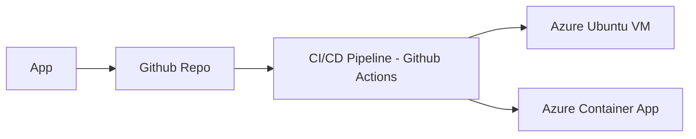

+++
title = "Use Github Actions to Deploy a Containerized WebApp"
weight = 1
date = 2024-03-27
draft = false
+++

## Introduction

This tutorial shows how to setup Github Actions in order to deploy a containerized ASP.NET Core Webapp to two different Azure compute services - Azure VM and Azure Container Apps. The VM runs Ubuntu and will use what is called a _self-hosted runner_ for the deployment. Azure _Container Apps_ is a serverless compute service where you can host your containerized apps. The latter requires Azure login credentials in the CI/CD pipeline.

## Prerequisites

In order to follow along, ensure you have the following tools installed on your machine:

- Docker (Docker Desktop) installed on your local machine. [Download Docker](https://www.docker.com/products/docker-desktop).
- Visual Studio Code (VSCode) as your IDE. [Download VSCode](https://code.visualstudio.com/Download).
docs.microsoft.com/en-us/dotnet/core/tools/).
- .NET SDK 8.0 installed to build .NET applications. [Install .NET](https://dotnet.microsoft.com/download).
- Azure CLI


## Method

There are many ways to implement the CI/CD pipeline. This tutorial shows some alternative approaches ranging from a very simplistic basic setup to a more feature rich setup including for instance cross-plattform builds.

We will utilize the Docker Registry provided by Github, called _Github Packages_.

Here are some terminology used in this solution:

- Docker, Buildx, Registry
- Github Actions, Github Packages, self-hosted runner, github hosted runner, gh secrets, sha
- Azure VM, Azure Container Apps, azure login rbac

Here is an overview of the solution



## Before we begin

Before we begin implementing the CI/CD pipeline in Github Actions, we need to create what we have in both ends of the pipeline.

In the appliction end we will create an ASP.NET Core Webapp. It will be a a very simple app, where we just use the built in scaffolding commands of dotnet. This app will be attached to a Github repo.

In the hosting end we  will setup two different targets. 1) An Azure VM running Ubuntu and 2) An Azure Container Apps solution. In both cases we will use the Azure CLI to provision the services.

### Develop the app

1. Create an empty directory called `MyDemoApp` and use the scaffolding command in dotnet to create the example webapp.
	
	```bash
	dotnet new webapp
	dotnet new gitignore
	```

2. We need to create a `Dockerfile` in order to containerize the app. We can do that using Docker CLI. Follow the instructions in the terminal. It will autodetect your project, so normally you only need to confirm the alternatives by pressing `<Enter>`.
	
	```bash
	docker init
	```
	
	Verify that you can run your application in a container locally.
	
	```bash
	docker build -t mydemoapp .
	docker run -p 8080:8080 ghcr.io/<repo>/mydemoapp
	docker push
	```
	
	> Change the repo to your own Github user name
	
	> Make sure you are logged in to github in the terminal. If not, run `gh login`
	
	Browse to `localhost:8080` and verify that it works.

3. Create a git repo push it to Github.
	
	```bash
	git init
	git add .
	git commit -m "Initial Commit"
	```
	
	Use the git function in the left menu bar in VSCode to create and push your repo to Github.


### Provision the hosts

#### Ubuntu VM on Azure

Follow this article to setup an [Ubuntu VM on Azure](https://cloud-developer.educ8.se/clo/2.-basic-cloud-applications/1.-tutorials/use-github-actions-to-deploy-your-app/index.html#step-3-provision-a-vm-with-a-self-hosted-runner) with Azure CLI.

#### Azure Container Apps

To provision the Azure Container App, follow these steps:

1. **Prepare Script Files**: Create a file: `provision_vm.sh` for provisioning the App.

	> provision_vm.sh
		
	```bash
	#!/bin/bash
		
	resource_group=DockerDemoRG
	location=northeurope
	env_name=DockerDemoEnv
	app_name= mydemoapp
	app_port=8080
	image=ghcr.io/<repo>/mydemoapp
		
	az group create --location $location --name $resource_group
		
	az containerapp env create --name $env_name --resource-group $resource_group --location $location
		
	az containerapp create --name $app_name --resource-group $resource_group \
	                       --image $image \
	                       --environment $env_name \
	                       --target-port $app_port \
	                       --ingress external --query properties.configuration.ingress.fqdn
		
	```
	> Change the repo to your own Github user name
	
	
	Verify that it works by browsing to the URL.

2. **Azure credentials**: Later when we setup the pipeline we need some Azure credentials in order to communicate from the pipeline to the Azure Container Apps service.
	
	Get the azure rbac credentials for github actions. [Azure Login](https://learn.microsoft.com/en-us/azure/developer/github/connect-from-azure?tabs=azure-portal%2Clinux)
	
	```bash
	az login
	az account list --output table
	 
	az ad sp create-for-rbac --name "github-actions-deployer" --role contributor --scopes /subscriptions/<subscription> --sdk-auth
	```
	
	Paste the json output into gh secrets (secrets.AZURE_CREDENTIALS)
	
	```json
	{
	  "clientId": "27a6...",
	  "clientSecret": "Rh...",
	  "subscriptionId": "ca0a77...",
	  "tenantId": "6e...",
	  "activeDirectoryEndpointUrl": "https://login.microsoftonline.com",
	  "resourceManagerEndpointUrl": "https://management.azure.com/",
	  "activeDirectoryGraphResourceId": "https://graph.windows.net/",
	  "sqlManagementEndpointUrl": "https://management.core.windows.net:8443/",
	  "galleryEndpointUrl": "https://gallery.azure.com/",
	  "managementEndpointUrl": "https://management.core.windows.net/"
	}
	
	```

## Create the CI/CD Pipeline

### Alt 1: Basic Setup

- Use docker commands directly from shell
- Use `needs` to indicate dependency between jobs (build -> deploy)
- Use github secrets (GITHUB_TOKEN and self-declared)
- Self-hosted and github-hosted runners
- Use permissions for the GITHUB_TOKEN secret


```yaml
name: CI/CD

on:
  push:
    branches:
      - main
  workflow_dispatch:
    
jobs:
  build_and_push:
    runs-on: ubuntu-latest

    permissions:
      contents: read
      packages: write
    
    steps:
      - name: Checkout the repository
        uses: actions/checkout@v4

      - name: Login to GitHub Container Registry
        run: echo "${{ secrets.GITHUB_TOKEN }}" | docker login ghcr.io -u ${{ github.actor }} --password-stdin

      - name: Build and push Docker image
        run: |
          docker build . -t ghcr.io/larsappel/dockerdemoapp:latest
          docker push ghcr.io/larsappel/dockerdemoapp:latest

  deploy_to_vm:
    needs: build_and_push
    runs-on: self-hosted

    steps:
      - name: Stop and remove existing container
        run: sudo docker stop dockerdemoapp || true && sudo docker rm dockerdemoapp || true

      - name: Start the new container
        run: sudo docker run -d -p 80:8080 --name dockerdemoapp ghcr.io/larsappel/dockerdemoapp:latest

  deploy_to_azure_container_apps:
    needs: build_and_push
    runs-on: ubuntu-latest

    steps:
      - name: Login to Azure
        uses: azure/login@v2
        with:
          creds: ${{ secrets.AZURE_CREDENTIALS }}

      - name: Deploy to Azure Container Apps
        run: |
          az containerapp update \
            --name dockerdemoapp \
            --resource-group DockerDemoRG \
            --image ghcr.io/larsappel/dockerdemoapp:latest
```


### Alt 2: With commit hash, parameters and outputs

- Calculates the commit hash
- Use output between jobs
- Use environment variables
- Use the repository name as image name


```yaml
name: CI/CD (with hash)

on:
  # Trigger the workflow on git push
  push:
    branches:
      - main
  # Allows you to run this workflow manually from the Actions tab
  workflow_dispatch:

env:
  # The registry to push the image to. Set to empty for Docker Hub
  REGISTRY: ghcr.io
  # On the format owner/repo. Might need to be lowercase
  IMAGE_NAME: ${{ github.repository }}

jobs:
  build_and_push:
    runs-on: ubuntu-latest

    # Outputs the short commit hash and the image name to be used in the next steps
    outputs:
      short_hash: ${{ steps.commit_hash.outputs.hash }}
      image_name: ${{ steps.lowercase_image_name.outputs.name }}

    # Permissions for the GITHUB_TOKEN
    permissions:
      contents: read
      packages: write
    
    steps:
      - name: Checkout the repository
        uses: actions/checkout@v4

      - name: Calculate the short commit hash
        id: commit_hash
        run: echo "hash=$(echo ${{ github.sha }} | cut -c1-7)" >> $GITHUB_OUTPUT

      - name: Make sure the image name is lowercase
        id: lowercase_image_name
        run: echo "name=${REGISTRY}/${IMAGE_NAME,,}" >> $GITHUB_OUTPUT

      - name: Login to GitHub Container Registry
        run: echo "${{ secrets.GITHUB_TOKEN }}" | docker login ${{ env.REGISTRY }} -u ${{ github.actor }} --password-stdin

      - name: Build and push Docker image
        run: |
          docker build . -t ${{ steps.lowercase_image_name.outputs.name }}:${{ steps.commit_hash.outputs.hash }} \
                         -t ${{ steps.lowercase_image_name.outputs.name }}:latest
          docker push --all-tags ${{ steps.lowercase_image_name.outputs.name }}

  deploy_to_vm:
    needs: build_and_push
    runs-on: self-hosted

    steps:
      - name: Stop and remove existing container
        run: sudo docker stop dockerdemoapp || true && sudo docker rm dockerdemoapp || true

      - name: Start the new container
        run: sudo docker run -d -p 80:8080 --name dockerdemoapp ${{ needs.build_and_push.outputs.image_name }}:${{ needs.build_and_push.outputs.short_hash }}

  deploy_to_azure_container_apps:
    needs: build_and_push
    runs-on: ubuntu-latest

    steps:
      - name: Login to Azure
        uses: azure/login@v2
        with:
          creds: ${{ secrets.AZURE_CREDENTIALS }}

      - name: Deploy to Azure Container Apps
        run: |
          az containerapp update \
            --name dockerdemoapp \
            --resource-group DockerDemoRG \
            --image ${{ needs.build_and_push.outputs.image_name }}:${{ needs.build_and_push.outputs.short_hash }}
            
```


### Alt 3: Actions

- Use actions from Docker to login, tag and build
- Remove actions/checkout. Done in docker/build-push-action (don't use: `context: .`)


```yaml
name: CI/CD (with Docker actions)

on:
  # Trigger the workflow on git push
  push:
    branches:
      - main
  # Allows you to run this workflow manually from the Actions tab
  workflow_dispatch:

env:
  # The registry to push the image to. Set to empty for Docker Hub
  REGISTRY: ghcr.io
  # On the format owner/repo. Might need to be lowercase
  IMAGE_NAME: ${{ github.repository }}

jobs:
  build_and_push:
    runs-on: ubuntu-latest

    # Outputs the image name to be used in the next steps
    outputs:
      image_name: ${{ steps.image_with_sha_tag.outputs.name }}

    # Permissions for the GITHUB_TOKEN. Used under the hood in docker/build-push-action
    permissions:
      contents: read
      packages: write
    
    steps:
      - name: Login to the Container Registry
        uses: docker/login-action@v3
        with:
          registry: ${{ env.REGISTRY }}
          username: ${{ github.actor }}
          password: ${{ secrets.GITHUB_TOKEN }}

      - name: Set image name and tag
        uses: docker/metadata-action@v5
        id: metadata
        with:
          images: ${{ env.REGISTRY }}/${{ env.IMAGE_NAME }}
          tags: |
            latest
            type=sha

      - name: Build and push Docker image
        uses: docker/build-push-action@v5
        with:
          push: true
          tags: ${{ steps.metadata.outputs.tags }}
          labels: ${{ steps.metadata.outputs.labels }}

      - name: Set the output to the image name with the SHA tag
        id: image_with_sha_tag
        run: |
          NAME=$(echo "${{ steps.metadata.outputs.tags }}" | tr ',' '\n' | grep 'sha')
          echo "name=${NAME}" >> $GITHUB_OUTPUT

  deploy_to_vm:
    needs: build_and_push
    runs-on: self-hosted

    steps:
      - name: Stop and remove existing container
        run: sudo docker stop dockerdemoapp || true && sudo docker rm dockerdemoapp || true

      - name: Start the new container
        run: sudo docker run -d -p 80:8080 --name dockerdemoapp ${{ needs.build_and_push.outputs.image_name }}

  deploy_to_azure_container_apps:
    needs: build_and_push
    runs-on: ubuntu-latest

    steps:
      - name: Login to Azure
        uses: azure/login@v2
        with:
          creds: ${{ secrets.AZURE_CREDENTIALS }}

      - name: Deploy to Azure Container Apps
        run: |
          az containerapp update \
            --name dockerdemoapp \
            --resource-group DockerDemoRG \
            --image ${{ needs.build_and_push.outputs.image_name }}
```


### Alt 4: Multi-platform

- Use Qemu and Buildx to build multi plattform images

```yaml
name: CI/CD (Multiplatform)

on:
  # Trigger the workflow on git push
  push:
    branches:
      - main
  # Allows you to run this workflow manually from the Actions tab
  workflow_dispatch:

env:
  # The registry to push the image to. Set to empty for Docker Hub
  REGISTRY: ghcr.io
  # On the format owner/repo. Might need to be lowercase
  IMAGE_NAME: ${{ github.repository }}

jobs:
  build_and_push:
    runs-on: ubuntu-latest

    # Outputs the image name to be used in the next steps
    outputs:
      image_name: ${{ steps.image_with_sha_tag.outputs.name }}

    # Permissions for the GITHUB_TOKEN. Used under the hood in docker/build-push-action
    permissions:
      contents: read
      packages: write
    
    steps:
      - name: Login to the Container Registry
        uses: docker/login-action@v3
        with:
          registry: ${{ env.REGISTRY }}
          username: ${{ github.actor }}
          password: ${{ secrets.GITHUB_TOKEN }}

      - name: Set image name and tag
        uses: docker/metadata-action@v5
        id: metadata
        with:
          images: ${{ env.REGISTRY }}/${{ env.IMAGE_NAME }}
          tags: |
            latest
            type=sha

      - name: Setup QEMU
        uses: docker/setup-qemu-action@v3

      - name: Setup Buildx for multi-platform builds
        uses: docker/setup-buildx-action@v3

      - name: Build and push Docker image
        uses: docker/build-push-action@v5
        with:
          push: true
          tags: ${{ steps.metadata.outputs.tags }}
          labels: ${{ steps.metadata.outputs.labels }}
          platforms: linux/amd64,linux/arm64

      - name: Set the output to the image name with the SHA tag
        id: image_with_sha_tag
        run: |
          NAME=$(echo "${{ steps.metadata.outputs.tags }}" | tr ',' '\n' | grep 'sha')
          echo "name=${NAME}" >> $GITHUB_OUTPUT

  deploy_to_vm:
    needs: build_and_push
    runs-on: self-hosted

    steps:
      - name: Stop and remove existing container
        run: sudo docker stop dockerdemoapp || true && sudo docker rm dockerdemoapp || true

      - name: Start the new container
        run: sudo docker run -d -p 80:8080 --name dockerdemoapp ${{ needs.build_and_push.outputs.image_name }}

  deploy_to_azure_container_apps:
    needs: build_and_push
    runs-on: ubuntu-latest

    steps:
      - name: Login to Azure
        uses: azure/login@v2
        with:
          creds: ${{ secrets.AZURE_CREDENTIALS }}

      - name: Deploy to Azure Container Apps
        run: |
          az containerapp update \
            --name dockerdemoapp \
            --resource-group DockerDemoRG \
            --image ${{ needs.build_and_push.outputs.image_name }}
      
```

# Related Topics

## Dependabot

- Automatically create pull requests to update actions to new versions with [dependabot](https://docs.github.com/en/code-security/dependabot/working-with-dependabot/keeping-your-actions-up-to-date-with-dependabot)


> .github/dependabot.yaml

```yaml
# Set update schedule for GitHub Actions

version: 2
updates:

  - package-ecosystem: "github-actions"
    directory: "/"
    schedule:
      # Check for updates to GitHub Actions every week
      interval: "weekly"
```

> Note: [Automating Dependabot](https://docs.github.com/en/code-security/dependabot/working-with-dependabot/automating-dependabot-with-github-actions#common-dependabot-automations) with GitHub Actions

## Workflow gallery

Creating [starter workflows](https://docs.github.com/en/actions/using-workflows/creating-starter-workflows-for-your-organization) for your organization


## Save State
Action and workflow authors who are using save-state or set-output via stdout should update to use the new environment files. [See article](https://github.blog/changelog/2022-10-11-github-actions-deprecating-save-state-and-set-output-commands/).

Examples

A workflow using save-state or set-output like the following

```yaml
- name: Save state
run: echo "::save-state name={name}::{value}"

- name: Set output
run: echo "::set-output name={name}::{value}"
```

should be updated to write to the new `GITHUB_STATE` and `GITHUB_OUTPUT` environment files:

```yaml
- name: Save state
run: echo "{name}={value}" >> $GITHUB_STATE

- name: Set output
run: echo "{name}={value}" >> $GITHUB_OUTPUT
```

## External Links

Links

https://learn.microsoft.com/en-us/shows/containers-with-dotnet-and-docker-for-beginners/

https://docs.docker.com/engine/install/ubuntu/

https://docs.docker.com/language/dotnet/containerize/


# Happy Deploying! 🚀


