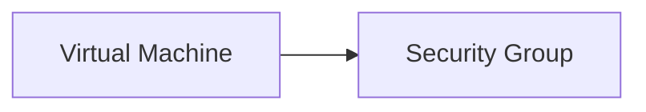

+++
title = "Provision Docker Swarm for ToDo App"
weight = 2
date = 2024-05-16
draft = true
+++

## Introduction

This tutorial is designed to show how you can deploy a ToDo app using MongoDB in a Docker Swarm Cluster

## Method

- We will use the AWS portal to provision the servers
- Access to the deployed VM will be via SSH using a private/public key pair.

## Prerequisites

- An AWS account. If you don't have one, sign up [here](https://aws.amazon.com/).
- Basic familiarity with YAML and the [AWS Command-Line Interface (CLI)](https://docs.aws.amazon.com/cli/latest/userguide/cli-chap-getting-started.html).
- For Windows users: GitBash or similar terminal (Mac and Linux users can use the pre-installed terminal)

## Provision three EC2 instances

### Prepare Your First CF Template

Create a YAML file named `vm_cf_template.yaml` and paste in the following ARM template code

> `vm_cf_template.yaml`

```yaml
---
AWSTemplateFormatVersion: "2010-09-09"

Description: >
  This is a basic template to provision a VM with Nginx
  OS: Amazon Linux 2023
  App: Nginx

Resources:
  # Security group for SSH access to the EC2 instance
  EC2SecurityGroup:
    Type: AWS::EC2::SecurityGroup
    Properties:
      GroupDescription: Security group for SSH access to the EC2 instance
      SecurityGroupIngress:
      - IpProtocol: tcp
        FromPort: '22'
        ToPort: '22'
        CidrIp: 0.0.0.0/0
```

With this structure, you have a minimal Cloudformation template defining only a security group. We will fill in more resources as needed during this tutorial.

**Provision the Cloudformation Template Using AWS CLI**

Navigate to the directory containing your CF template.

Run these commands:

```bash
aws cloudformation create-stack --template-body file://vm_cf_template.yaml --stack-name EC2DemoStack
```

At this stage you should have a security group provisioned on AWS.

Verify the success of the deployment in the AWS console:

1. **Navigate to Cloudformation:** In the AWS console, locate and click on the "Cloudformation" section.
2. **Select the Stack:** Choose the stack where you deployed the CF template.
3. **Stack Section:** Within the stack, choose the tab labeled "Resources" in the menu.
4. **View Resources:** Here, you'll see a list of provisioned resources according to the CF template. Click on the resource to view its details.

**Provision the Resources iteratively step-by-step**

A CF template is _idempotent_, which means you can run it several times and expect the same outcome. Changes in the template will be reflected in what is provisioned. This gives us an opportunity to develop the resources we want in an iterative way.

For each change you want to provision you can run the `aws cloudformation update-stack` command.

If something goes wrong during the process and you want to start all over, the easiest way is to delete the resource group and start fresh with a new resource group.

You can run the folowing command to delete the resource group: (just in case you want to start fresh)

```bash
aws cloudformation delete-stack --stack-name EC2DemoStack
```

**Start the developing process**

Before we begin we need to analyze the minimal configuration of a VM.

Mandatory Properties of a VM

- Type: Identifies the resource type as a virtual machine ("AWS::EC2::Instance").
- Properties: Contains the following nested mandatory properties:
  - InstanceType: The size of the VM (e.g. "t2.micro").
  - ImageId: The AMI (e.g. ami-0d421d84814b7d51c, which is Amazon Linux 2023)
  - KeyName: The name of the public key (make sure the key exists on the AWS platform)
  - SecurityGroups: A list of attached security groups

Cloudformation will automatically analyze the dependencies between resources and provision them accordingly. This means that you don´t have to consider the execution order in the CF script.

In order to develop the CF template we need to understand the dependencies a VM has on other resources. Let's break it down and visualize it in a graph.



The easies way is to build the template is from _ground up_ i.e. beginning with the resources without any dependencies. The approach we will take is to add resources in the following order and verify them in the Azure portal between each iteration.

1. Security Group
2. Virtual Machine

When the resources are provisioned we will continue to configure them. In the case of the VM we will use Cloud-init (UserData).

## Provision The Virtual Machine

- One resource we need to have before we provision the VM is the SSH key. If you have one already you can use that one. If you want to create a new one for theis tutorial you can do that using AWS CLI like this:

    ```bash
    aws ec2 create-key-pair --key-name MyDemoKey --query 'KeyMaterial' --output text > MyDemoKey.pem
    ```

- This will create a public key on AWS and download the private key to your local environment. If you are on Mac or Linux, don´t forget to chmod the key.

    ```bash
    chmod 400 MyDemoKey.pem
    ```

- In order to find the latest Amazon Linux 2023 AMI you can either go to the AWS Console or run the the following AWS CLI command:

    ```bash
    aws ssm get-parameter --name "/aws/service/ami-amazon-linux-latest/al2023-ami-kernel-default-x86_64" --query "Parameter.Value" --output text
    ```

Let´s add the EC2 resource to the CF template and provision the template again:

> `vm_cf_template.yaml`

```yaml
---
AWSTemplateFormatVersion: "2010-09-09"

...

  # EC2 instance
  EC2Instance:
    Type: AWS::EC2::Instance
    Properties:
      InstanceType: t2.micro
      ImageId: ami-0d421d84814b7d51c
      KeyName: MyDemoKey
      SecurityGroups:
      - !Ref EC2SecurityGroup
```

Run the create-stack command again:

```bash
aws cloudformation create-stack --template-body file://vm_cf_template.yaml --stack-name EC2DemoStack
```

> If you didn´t delete the stack previously you have to use the update-stack command instead.
>
>```bash
>aws cloudformation update-stack --template-body file://vm_cf_template.yaml --stack-name EC2DemoStack
>```

### Verify the provisioning. Access the VM

Go to the AWS Console -> Cloudformation and verify that the stack completed correctly.
Continue to the provisioned EC2 and log in to it.

- Use SSH to connect to your VM:
  ```bash
  ssh -i "MyDemoKey.pem" ec2-user@<DNSorIP>
  ```

- Confirm that the VM is running Amazon Linux 2023 by checking the os information:

  ```bash
  cat /etc/os-release
  ```

    > Output

    ```bash
    NAME="Amazon Linux"
    VERSION="2023"
    ID="amzn"
    ID_LIKE="fedora"
    VERSION_ID="2023"
    PLATFORM_ID="platform:al2023"
    PRETTY_NAME="Amazon Linux 2023.4.20240416"
    ANSI_COLOR="0;33"
    CPE_NAME="cpe:2.3:o:amazon:amazon_linux:2023"
    HOME_URL="https://aws.amazon.com/linux/amazon-linux-2023/"
    DOCUMENTATION_URL="https://docs.aws.amazon.com/linux/"
    SUPPORT_URL="https://aws.amazon.com/premiumsupport/"
    BUG_REPORT_URL="https://github.com/amazonlinux/amazon-linux-2023"
    VENDOR_NAME="AWS"
    VENDOR_URL="https://aws.amazon.com/"
    SUPPORT_END="2028-03-15"
    ```

## Use Cloud-Init to Install Nginx

In order to install Nginx on the VM we need to:

1. Open port 80 in the Security Group
2. Add UserData to the EC2 resource

> Note!
>
> Cloud init is only run once, when the VM is first provisioned. This means that we need to delete the stack and recreate it again, so that a new EC2 is provisioned

Delete the stack:

```bash
aws cloudformation delete-stack --stack-name EC2DemoStack
```

**Open port 80 in the Security Group**

```yaml
      - IpProtocol: tcp
        FromPort: '80'
        ToPort: '80'
        CidrIp: 0.0.0.0/0
```

**Add UserData to the EC2 resource**

```yaml
      UserData:
        Fn::Base64: !Sub |
          #!/bin/bash -xe

          # Install Nginx
          dnf update -y
          dnf install -y nginx
          systemctl start nginx
          systemctl enable nginx
```

Create the stack:

```bash
aws cloudformation create-stack --template-body file://vm_cf_template.yaml --stack-name EC2DemoStack
```


## Troubleshooting

- **YAML format**: When using YAML, be very careful with the indentation

## Final Thoughts

This tutorial demonstrates a _code-first_ approach to provisioning a VM in AWS, enhancing reproducibility and efficiency. CF templates offer a powerful way to manage AWS resources _declaratively_, allowing for easy versioning, sharing, and modification.

Consider exploring additional VM configurations and AWS services to further enhance your cloud infrastructure.

Here are some next step improvements to consider:

1. **Parameterize Inputs**: Convert fixed values, such as AMI, names, and network configurations, into parameters. This allows for more flexible deployments without modifying the template directly.

2. **Outputs**: Utilize the outputs section to return important information post-provisioning, such as the public IP address of the VM, to easily access the provisioned resources.


## Don't Forget

Always clean up resources you no longer need to manage costs effectively.

Now you can delete the stack using this command:

```bash
aws cloudformation delete-stack --stack-name EC2DemoStack
```

# Happy Provisioning on AWS! 🚀


### References:

Cloudformation Template Anatomy: https://docs.aws.amazon.com/AWSCloudFormation/latest/UserGuide/template-anatomy.html

Cloudformation AWS::EC2::SecurityGroup reference: https://docs.aws.amazon.com/AWSCloudFormation/latest/UserGuide/aws-resource-ec2-securitygroup.html

Cloudformation AWS::EC2::Instance reference: https://docs.aws.amazon.com/AWSCloudFormation/latest/UserGuide/aws-resource-ec2-instance.html

Find lates AMI for Amazon Linux 2023:

https://docs.aws.amazon.com/linux/al2023/ug/ec2.html

https://docs.aws.amazon.com/linux/al2023/ug/ec2.html#launch-from-cloudformation


# TL;DR

Here are all the AWS CLI commands used in this tutorial:

Create a key pair

```bash
aws ec2 create-key-pair --key-name MyDemoKey --query 'KeyMaterial' --output text > MyDemoKey.pem
chmod 400 MyDemoKey.pem
```

Create, update and delete a CF stack

```bash

# Create stack
aws cloudformation delete-stack --stack-name EC2DemoStack

# Update stack
aws cloudformation update-stack --template-body file://vm_cf_template.yaml --stack-name EC2DemoStack

# Delete stack
aws cloudformation delete-stack --stack-name EC2DemoStack

```

Use SSH to connect to the VM:

```bash
ssh -i "MyDemoKey.pem" ec2-user@<DNSorIP>

# Example:
ssh -i "MyDemoKey.pem" ec2-user@ec2-52-208-179-245.eu-west-1.compute.amazonaws.com
```

Here is the complete CF template:

> `vm_cf_template.yaml`

```yaml
---
AWSTemplateFormatVersion: "2010-09-09"

Description: >
  This is a basic template to provision a VM with Nginx
  OS: Amazon Linux 2023
  App: Nginx

Resources:
  # Security group for SSH access to the EC2 instance
  EC2SecurityGroup:
    Type: AWS::EC2::SecurityGroup
    Properties:
      GroupDescription: Security group for SSH access to the EC2 instance
      SecurityGroupIngress:
      - IpProtocol: tcp
        FromPort: '22'
        ToPort: '22'
        CidrIp: 0.0.0.0/0
      - IpProtocol: tcp
        FromPort: '80'
        ToPort: '80'
        CidrIp: 0.0.0.0/0

  # EC2 instance
  EC2Instance:
    Type: AWS::EC2::Instance
    Properties:
      InstanceType: t2.micro
      ImageId: ami-0d421d84814b7d51c
      KeyName: MyDemoKey
      SecurityGroups:
      - !Ref EC2SecurityGroup
      UserData:
        Fn::Base64: !Sub |
          #!/bin/bash -xe

          # Install Nginx
          dnf update -y
          dnf install -y nginx
          systemctl start nginx
          systemctl enable nginx
```
