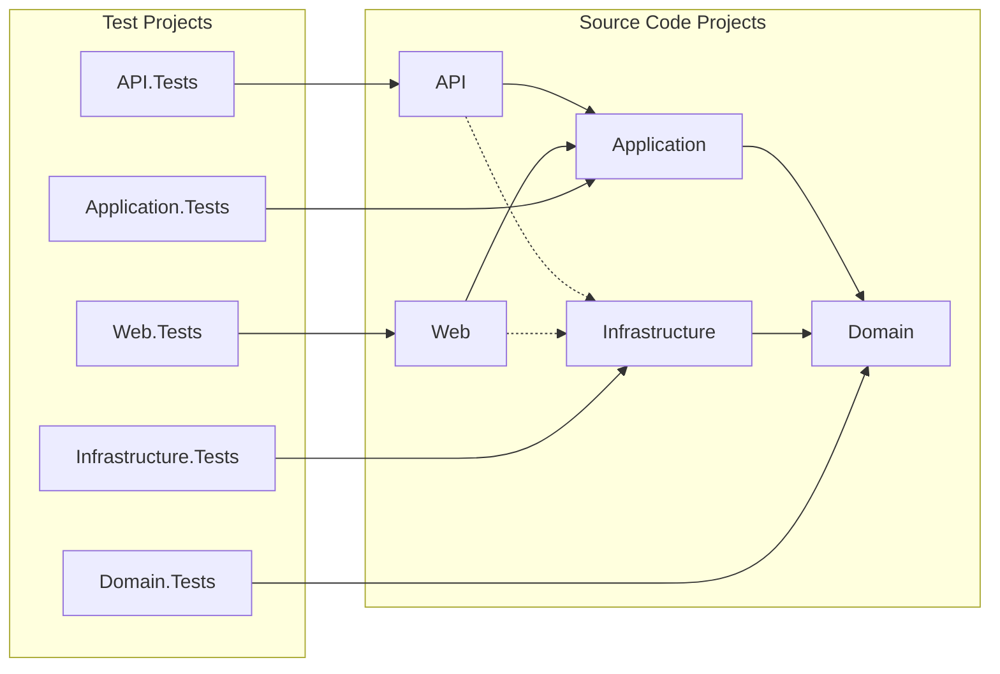

+++
title = 'How to create a Clean Archticture solution'
weight = 1
date = 2024-08-15
draft = false
+++

> ### Clone this repo to get started

```bash
git clone https://github.com/CLO-AttDriftaMolnapplikationer/DemoCleanSolution.git
```

## The Dependency Graph

This is the dependency graph between the projects in the solution



### Example: User


## Bash Script


This Bash script creates a solution

```bash
./create_solution.sh DemoApp
```

> `create_solution.sh`

```bash
#!/bin/bash

solution_name=$1

if [ -z "$solution_name" ]; then
  echo "Please provide a solution name"
  exit 1
fi

mkdir $solution_name
cd $solution_name

# Create the solution structure
mkdir src tests docs
dotnet new sln -n $solution_name

# Create the source code projects
dotnet new webapi -o src/$solution_name.API
dotnet new mvc -o src/$solution_name.Web
dotnet new classlib -o src/$solution_name.Application
dotnet new classlib -o src/$solution_name.Domain
dotnet new classlib -o src/$solution_name.Infrastructure

# Add the source code projects to the solution
dotnet sln add src/$solution_name.API/$solution_name.API.csproj
dotnet sln add src/$solution_name.Web/$solution_name.Web.csproj
dotnet sln add src/$solution_name.Application/$solution_name.Application.csproj
dotnet sln add src/$solution_name.Domain/$solution_name.Domain.csproj
dotnet sln add src/$solution_name.Infrastructure/$solution_name.Infrastructure.csproj

# Create the test projects
dotnet new xunit -o tests/$solution_name.API.Tests
dotnet new xunit -o tests/$solution_name.Web.Tests
dotnet new xunit -o tests/$solution_name.Application.Tests
dotnet new xunit -o tests/$solution_name.Domain.Tests
dotnet new xunit -o tests/$solution_name.Infrastructure.Tests

# Add the test projects to the solution
dotnet sln add tests/$solution_name.API.Tests/$solution_name.API.Tests.csproj
dotnet sln add tests/$solution_name.Web.Tests/$solution_name.Web.Tests.csproj
dotnet sln add tests/$solution_name.Application.Tests/$solution_name.Application.Tests.csproj
dotnet sln add tests/$solution_name.Domain.Tests/$solution_name.Domain.Tests.csproj
dotnet sln add tests/$solution_name.Infrastructure.Tests/$solution_name.Infrastructure.Tests.csproj

# Add project references between the source code projects
dotnet add src/$solution_name.Infrastructure/$solution_name.Infrastructure.csproj reference src/$solution_name.Domain/$solution_name.Domain.csproj
dotnet add src/$solution_name.Application/$solution_name.Application.csproj reference src/$solution_name.Domain/$solution_name.Domain.csproj
dotnet add src/$solution_name.API/$solution_name.API.csproj reference src/$solution_name.Application/$solution_name.Application.csproj
dotnet add src/$solution_name.API/$solution_name.API.csproj reference src/$solution_name.Infrastructure/$solution_name.Infrastructure.csproj
dotnet add src/$solution_name.Web/$solution_name.Web.csproj reference src/$solution_name.Application/$solution_name.Application.csproj
dotnet add src/$solution_name.Web/$solution_name.Web.csproj reference src/$solution_name.Infrastructure/$solution_name.Infrastructure.csproj

# Add project references between the test projects and the source code projects
dotnet add tests/$solution_name.Infrastructure.Tests/$solution_name.Infrastructure.Tests.csproj reference src/$solution_name.Infrastructure/$solution_name.Infrastructure.csproj
dotnet add tests/$solution_name.Domain.Tests/$solution_name.Domain.Tests.csproj reference src/$solution_name.Domain/$solution_name.Domain.csproj
dotnet add tests/$solution_name.Application.Tests/$solution_name.Application.Tests.csproj reference src/$solution_name.Application/$solution_name.Application.csproj
dotnet add tests/$solution_name.API.Tests/$solution_name.API.Tests.csproj reference src/$solution_name.API/$solution_name.API.csproj
dotnet add tests/$solution_name.Web.Tests/$solution_name.Web.Tests.csproj reference src/$solution_name.Web/$solution_name.Web.csproj

dotnet restore
dotnet build

```
